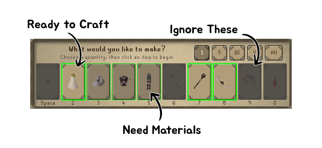
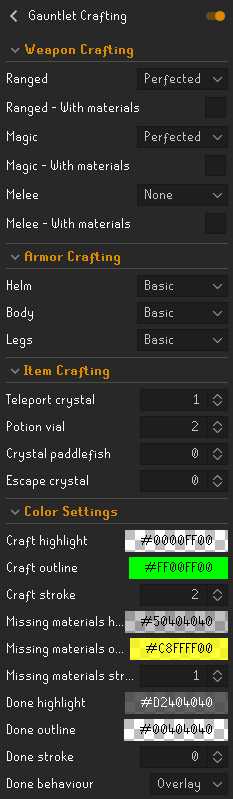

# Gauntlet Crafting 

Highlight crafting options that should be performed during the gauntlet

## Benefits

1. See what to craft at a glance
2. Avoid upgrading armor accidentally
3. Never forget to make another teleport crystal

## Customization

1. Choose the tier of weapons and armor to create
2. Set number of additional items to create
3. Change colors for each state

### Options

**Ignore**
> Will never highlight or dim this option, vanilla

**None**
> This option will always be dimmed, never craft this

**Basic/Attuned/Perfected**
> The goal tier to be crafted.  
> Highlight when missing materials or ready to craft, dim when this tier has been crafted

**With materials**
> Only highlight this option be crafted if you have _all_ the materials to craft this tier and all previous tiers

**Item count**
> Highlight this item if you have less than the number shown